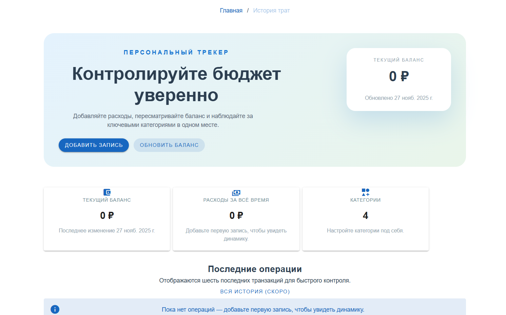

# Personal Finance Tracker

Одностраничное приложение на Vue 3 для ведения личных финансов. Оно помогает фиксировать траты, контролировать баланс и видеть распределение расходов по категориям на диаграмме.



## Основные возможности

- 📊 **Обзор финансов** — карточки с текущим балансом, суммой расходов и количеством задействованных категорий.
- 🧾 **История операций** — последние транзакции с категорией, датой, суммой и комментарием.
- ➕ **Быстрое добавление записей** — диалог с выбором категории, суммы, комментария и опцией сразу уменьшить баланс.
- 💼 **Редактирование баланса** — отдельный диалог для ручного обновления остатка.
- 🍩 **Диаграмма расходов** — круговая диаграмма на Chart.js, автоматически пересчитывает суммы по категориям.

## Технологии

| Категория | Стек |
| --- | --- |
| Фреймворк | [Vue 3](https://vuejs.org/) + `<script setup>` |
| Состояние | [Pinia](https://pinia.vuejs.org/) |
| UI | [Vuetify 3](https://next.vuetifyjs.com/) + Material Design Icons |
| Диаграммы | [Chart.js](https://www.chartjs.org/) |
| Прочее | TypeScript, Vite tooling от Vue CLI |

## Быстрый старт

### Требования

- Node.js ≥ 18
- npm ≥ 9

### Установка и запуск

```bash
git clone https://github.com/Nilsson03/personal-finance-tracker.git
cd personal-finance-tracker
npm install
npm run serve
```

Приложение будет доступно по адресу `http://localhost:8080`.

### Сборка и линтинг

```bash
npm run build   # production
npm run lint    # eslint + typescript
```

## Структура проекта

```
src/
 ├─ components/
 │   ├─ home/       # Главная страница и связанные стили
 │   └─ diagrams/   # Диаграмма расходов (Chart.js)
 ├─ store/          # Pinia store для транзакций и баланса
 ├─ type/           # Типы (Transaction, Category)
 └─ main.ts         # Точка входа, подключение Vuetify и Pinia
```

## Roadmap

- [ ] Редактирование категорий (цвет, иконка, порядок)
- [ ] Учёт доходов и сравнение с расходами
- [ ] Отдельная страница с полной историей и фильтрами
- [ ] Экспорт данных и интеграция с облачным бэкапом

## Вклад

Предложения и PR приветствуются. Перед вкладом запустите `npm run lint` и убедитесь, что приложение собирается локально.

---

> Проект создавался как демонстрация навыков работы с Vue 3, Vuetify, Pinia и Chart.js.
